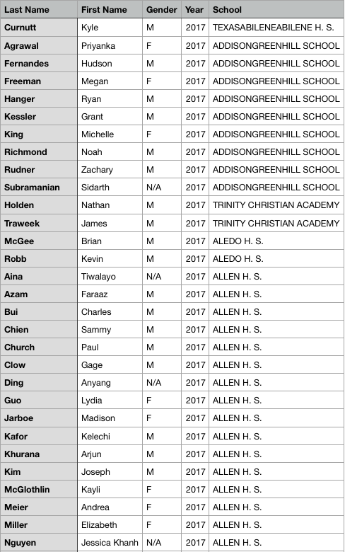

# National-Merit-Data-Extraction
Reads in pdfs of national merit semifinalists and extracts data such as name, year, school, gender and writes it to a csv file. This data can then be used for analysis purposes.

# Issues
- Some people have gender assigned as N/A bc the text file didn't contain their names; either use multiple years' names or find a better names list
- The way PyPDF2 reads PDFs means that multiple lines can be appended together. This is what happened with school names. I was able to fix some, but others have the city name and school name stuck together in the school section of the csv file

